# Data ISC — Import. Simulate. Compare.

**Open-source time-series simulation engine.** Upload any CSV or XLSX file, visualise trajectories, project forward, and run what-if scenarios — no account, no setup, data stays in your browser.



> **[▶ Try the live demo](https://dataisc.github.io/data-isc/)** — slide the dials in your browser, no install required.

---

## Deploy your own — one click

Host your own live instance in under a minute. No clone, no `npm install`, no local server.

| Provider | What you get | Button |
|----------|--------------|--------|
| **Render** | **Full live server** — scenarios compute at any start year, FX + CSV proxies enabled | [](https://render.com/deploy?repo=https://github.com/dataisc/data-isc) |
| **Netlify** | Static demo (scenarios at preset start years) | [](https://app.netlify.com/start/deploy?repository=https://github.com/dataisc/data-isc) |
| **Vercel** | Static demo (scenarios at preset start years) | [](https://vercel.com/new/clone?repository-url=https://github.com/dataisc/data-isc) |
| **Cloudflare** | Static demo (scenarios at preset start years) | [](https://deploy.workers.cloudflare.com/?url=https://github.com/dataisc/data-isc) |

**Which should I pick?**

- **Want the complete experience?** Use **Render** — it runs the real Node server (`server.js`), so what-if scenarios compute live for any start year (2026–2080) and the FX-rate and CSV-from-URL proxies work. The model logic stays server-side; the browser only ever receives computed output.
- **Just want to show it off instantly?** Use **Netlify, Vercel, or Cloudflare**. These publish the `public/` folder as static files. The build pre-renders the model's API *output* into `public/api-static/` (via [`scripts/snapshot-api.js`](scripts/snapshot-api.js) — never the model parameters), and the client's static fallback loads it automatically. Scenarios are shown at preset start years (2026, 2030, 2035, 2040, 2050).

> Cloudflare may prompt you for build settings — set **Build command** to `npm run build:static` and **Output directory** to `public`. Netlify and Vercel read these automatically from `netlify.toml` / `vercel.json`.

The same static build also powers the [GitHub Pages demo](https://dataisc.github.io/data-isc/) — see [`.github/workflows/deploy-pages.yml`](.github/workflows/deploy-pages.yml).

---

## What it does

- **Any dataset** — upload a CSV or XLSX and the engine auto-detects time axis, entities, and value columns. Economic indicators, clinical trial data, energy output, sales figures — if it evolves over time, it works.
- **Projection engine** — fits a trend (linear or exponential, auto-selected by R²) per entity and projects forward. Quarterly, weekly, monthly, fiscal-year time formats all handled.
- **What-if scenarios** — start from the **🦢 Black Swan preset library** (one-click economic shocks like an automation wave, fertility crisis, decoupling, pandemic, or energy shock that auto-disperse across your entities), or build structured scenarios with per-entity rates, time-phased impacts, and value ceilings — no AI key required. Connect your own AI provider for causal per-entity breakdowns. Import/export scenarios as JSON for sharing and version control.
- **Scenario branching (GitDiff)** — branch the baseline into two rival futures (e.g. high automation vs severe demographic strain), each its own stack of scenarios, and watch the two timelines diverge on a single graph. A shaded divergence band and live delta readout show the gap widening or narrowing year by year.
- **Map, chart & trajectory views** — choropleth world map with a time scrubber, ranked Top 10 bars at any year, and a multi-entity trajectory line chart — switch freely and share any view by URL.
- **Bar Chart Race** — animated ranking race across the full simulation timeline. Scenario effects apply live, reshaping trajectories from the shock year onward. Smart callouts surface leader changes and landmark milestones automatically as they happen.
- **Social video export** — export the race as a WebM video in 16:9 (LinkedIn/Facebook), 1:1 (Instagram feed), or 9:16 (Reels/TikTok/Shorts) — no post-production required.
- **Share & embed** — every view is shareable via a URL hash. One click generates an `<iframe>` snippet or an `<economic-sandbox-widget>` web component ready for Notion, papers, Substacks, or BI dashboards.
- **Built-in GDP demo** — 100 countries + 5 regional aggregates, 1990–2100, with ready-to-run scenario presets (global carbon tax, free-trade expansion, EU federal integration). Explore out of the box, replace with your own data when ready.

---

## Quick start

```bash
git clone https://github.com/dataisc/data-isc
cd data-isc
npm install
node server.js
# Open http://localhost:3000
```

Requires **Node.js ≥ 18**. No database, no external services, no API key required to get started.

**Or with Docker:**

```bash
docker run -p 3000:3000 ghcr.io/dataisc/data-isc
```

Then open `http://localhost:3000`.

---

## Deploy your own instance

Spin up your own live copy in under a minute — no local clone, no `npm install`.

**Full app (live server)** — runs `server.js`, so scenarios compute live at any start year (2026–2080) and the FX / CSV-import proxies work. Model logic stays server-side.

[](https://render.com/deploy?repo=https://github.com/dataisc/data-isc)

**Static demo (instant, free, no server)** — publishes the `public/` site with the model's pre-rendered API output. Scenarios are shown at preset start years; live FX and CSV-from-URL import are disabled. Same build the [GitHub Pages demo](https://dataisc.github.io/data-isc/) uses.

[](https://app.netlify.com/start/deploy?repository=https://github.com/dataisc/data-isc)
[](https://vercel.com/new/clone?repository-url=https://github.com/dataisc/data-isc)
[](https://deploy.workers.cloudflare.com/?url=https://github.com/dataisc/data-isc)

The static hosts read their config from [`netlify.toml`](netlify.toml) / [`vercel.json`](vercel.json) (build command `node scripts/build-static.js`, publish `public/`). For Cloudflare Pages, set the build command to `node scripts/build-static.js` and the output directory to `public`.

---

## Sample datasets

The `samples/` folder contains ready-to-upload datasets to try the import flow immediately:

| File | Domain | Rows | Source |
|------|--------|------|--------|
| `co2_emissions.csv` | Environment | 6 600 | Our World in Data |
| `life_expectancy.csv` | Health | 7 200 | World Bank |
| `renewable_energy_share.csv` | Energy | 660 | IEA / Our World in Data |

Download, drag into the **Upload your dataset** button, and the engine detects the schema automatically.

---

## Scenario library

Ready-to-run **what-if scenarios** mapped to real macroeconomic and demographic theories live in [`samples/scenarios/`](samples/scenarios/) — self-contained JSON, no AI key required. Load one via the scenario builder's **↑ JSON** tab.

| Scenario | Theory |
|----------|--------|
| [`cyberpunk-2050.json`](samples/scenarios/cyberpunk-2050.json) | Automation singularity — tech economies soar, labour-arbitrage economies stall |
| [`ai-productivity-boom.json`](samples/scenarios/ai-productivity-boom.json) | Broad-based AI uplift — a rising tide |
| [`demographic-winter.json`](samples/scenarios/demographic-winter.json) | Global sub-replacement fertility over 80 years |
| [`great-decoupling.json`](samples/scenarios/great-decoupling.json) | Deglobalisation — trade-exposed hubs lose most |
| [`rapid-decarbonisation.json`](samples/scenarios/rapid-decarbonisation.json) | Net-zero push (for the renewables sample dataset) |
| [`pandemic-decade.json`](samples/scenarios/pandemic-decade.json) | Recurring health shocks (for the life-expectancy dataset) |

See the [library README](samples/scenarios/README.md) for pairing ideas and authoring notes. Got a theory of your own? [Contribute a scenario](samples/scenarios/README.md#contribute-your-own).

---

## MCP Server (Model Context Protocol)

Data ISC ships an MCP server that exposes the GDP simulation engine as native tools for AI agents — Claude Desktop, Cursor, or any MCP-compatible agent framework. No API key required on your end; the developer brings their own.

### Quick setup (Claude Desktop)

1. Clone the repo and install dependencies:
   ```bash
   git clone https://github.com/dataisc/data-isc
   cd data-isc
   npm install
   ```

2. Add to your Claude Desktop config (`~/.claude/claude_desktop_config.json`):
   ```json
   {
     "mcpServers": {
       "data-isc": {
         "command": "node",
         "args": ["/absolute/path/to/data-isc/mcp-server.js"]
       }
     }
   }
   ```

3. Restart Claude Desktop. The tools appear automatically — ask Claude:
   > *"Run a global carbon tax scenario starting in 2030 and compare USA vs China GDP through 2075."*

### Available tools

| Tool | What it does |
|------|-------------|
| `list_countries` | All 100 countries + regional aggregates with codes |
| `list_scenarios` | All policy scenarios with IDs, descriptions, severity |
| `get_gdp` | Baseline GDP trajectory for any countries and year range |
| `get_top_economies` | Ranked top-N economies for any year |
| `run_scenario` | Simulate one or more scenarios — returns baseline vs scenario delta |
| `compare_countries` | Head-to-head trajectory comparison with overtake detection |
| `get_regional_summary` | GDP by world region with share percentages |

### Running the MCP server directly

```bash
npm run mcp
# or
node mcp-server.js
```

The server uses **stdio transport** — no port, no API key, no auth. Your model logic stays server-side; agents receive only computed output arrays.

---

## Connecting AI (optional)

Built-in scenario analysis works without any API key. Connect your own AI provider to unlock per-entity impact estimates with causal reasoning:

| Provider | Cost | Setup time |
|----------|------|------------|
| [Groq](https://console.groq.com/keys) | Free tier | ~2 min |
| [Google Gemini](https://aistudio.google.com/apikey) | Free tier | ~2 min |
| Ollama | Free, fully local | ~5 min |
| Anthropic / OpenAI | Paid | ~2 min |

Click the **AI** button in the top-right corner. Your key is stored only in your browser — never sent to this server.

---

## Architecture

```
server.js                   Express server + API routes
models/
  gdp-trajectories/
    compute.js              GDP projection engine (server-side only)
    data/
      seed_data.json        Country parameters and growth milestones
      scenarios_policy.json Scenario definitions
public/
  index.html                Single-page client (D3.js, vanilla JS)
  style.css                 All styles
  model/                    Documentation sub-pages
  scenarios/                Scenario detail pages
samples/                    Sample CSV datasets
```

**Model logic stays server-side.** The browser receives only computed output arrays — never growth rates, calibration coefficients, or scenario parameters.

---

## Embedding

Any view can be embedded in a webpage, Notion page, Substack, or BI dashboard. Open `Export ▾ → Share / Embed`, configure width and height, and pick one of two formats with the toggle.

**1. `<iframe>`** — works anywhere, no JavaScript:

```html
<iframe
  src="https://yourhost/?embed=1#v=1&view=chart&year=2050&sc=POLICY_001&scy=2030&mode=gdp"
  width="100%" height="520px"
  frameborder="0"
  style="border-radius:8px;border:1px solid #1e293b"
  allowfullscreen>
</iframe>
```

**2. `<economic-sandbox-widget>` web component** — a tiny (~3 KB), dependency-free custom element served from `/embed.js`. Drop in the script once, then place the tag anywhere — and reconfigure it live from your own JS by setting attributes:

```html
<script src="https://yourhost/embed.js" async></script>
<economic-sandbox-widget scenario="POLICY_001" start="2030" view="chart" year="2050"></economic-sandbox-widget>
```

| Attribute  | Description                                              | Default |
|------------|---------------------------------------------------------|---------|
| `scenario` | Comma-separated scenario id(s), e.g. `POLICY_001,POLICY_007` | —       |
| `start`    | Scenario start year (2026–2080)                         | `2030`  |
| `view`     | `map` · `chart` · `race` · `table`                      | `map`   |
| `year`     | Timeline year to focus                                  | `2030`  |
| `width` / `height` | CSS size (e.g. `100%`, `520px`, `640`)          | `100%` / `520px` |
| `origin`   | Override the host origin (advanced)                     | where `embed.js` was served from |

All attributes are reactive — change one with `el.setAttribute('view', 'race')` and the widget updates in place. The component resolves the host origin from its own `<script src>`, so the proprietary economic model stays server-side and every embed points back to your instance.

Both formats render without header, controls, or navigation — just the chart with a small attribution link.

---

## What-if scenarios for imported datasets

Imported datasets don't use the GDP demo's structural policy scenarios (carbon tax, free trade, EU integration) — those are calibrated to country attributes. Instead, you get two tools that work on **any** dataset: the Black Swan preset library and the custom scenario builder.

### 🦢 Black Swan preset library

One-click economic shocks that map onto whatever dataset is loaded. Each preset applies a base annual δ and then **disperses** a per-entity rate derived from each entity's *own* time series — no AI key required.

| Preset | Base δ | Disperses by |
|--------|--------|--------------|
| 🤖 **2030 Automation Wave** | +2.5%/yr | Momentum — fast-growing entities compound the gains |
| 👶 **Sub-Replacement Fertility Crisis** | −1.8%/yr | Size — larger, mature entities hit hardest |
| 🌐 **Decoupling Shock** | −2.2%/yr | Size — biggest, most trade-exposed entities lose most |
| 🦠 **Pandemic Wave** | −3.5%/yr | Volatility — the swingiest entities react hardest |
| ⚡ **Energy Price Shock** | −2.5%/yr | Momentum — fast-growing, energy-hungry entities hit hardest |

The dispersion statistic (momentum, size, or volatility) is computed from each entity's series, so the same preset produces a different, dataset-appropriate spread every time. Apply a preset as-is, or use it as a starting point and refine it in the builder below.

### How the engine works

For each entity and each year within the scenario window, the engine applies a compound growth adjustment on top of the baseline:

```
adjusted_value(t) = baseline_value(t) × (1 + δ/100)^(t − t₀ + 1)
```

where `δ` is the annual impact rate (%) and `t₀` is the scenario start year. The exponent starts at 1 so the effect is visible immediately at `t₀`. Values are clamped to non-negative.

### Impact priority chain

When multiple sources specify a rate for the same entity and year, the engine applies the highest-priority source and ignores the rest:

| Priority | Source | When active |
|----------|--------|-------------|
| 1 | **AI per-entity impacts** | AI provider connected and analysis ran |
| 2 | **Per-entity overrides** | Entity is checked in the Per-Entity tab |
| 3 | **Phase rate** | Current year falls inside a defined phase window |
| 4 | **Global default δ** | Fallback for all in-scope entities |

### Scenario builder tabs

The in-app scenario builder exposes four tabs per scenario:

| Tab | Purpose |
|-----|---------|
| **Basic** | Name, description, year range, global default δ%/yr, optional value ceiling |
| **Per-Entity** | Entity-specific δ%/yr — each entity can have its own rate; unchecked entities are excluded from the scenario |
| **Phases** | Time-segmented rates — e.g. aggressive growth 2010–2015, then slowdown 2015–2020 |
| **↑ JSON** | Upload or paste a scenario JSON file; download a pre-filled template |

### Custom scenario JSON format

Scenarios can be authored as JSON files and imported via the **↑ JSON** tab or contributed to the repository as community scenarios. Download a template pre-filled with your dataset's entity names from the builder.

```json
{
  "id": "my_scenario",
  "name": "Green Transition",
  "description": "Accelerated shift to renewables — asymmetric impact by energy mix.",
  "version": "1.0",
  "author": "your-github-handle",
  "default_delta_pct": 1.5,
  "year_from": 2025,
  "year_to": 2040,
  "growth_ceiling": null,
  "entity_overrides": [
    { "entity": "Norway",  "delta_pct": 3.2 },
    { "entity": "Germany", "delta_pct": 2.1 },
    { "entity": "Poland",  "delta_pct": -0.8 }
  ],
  "phases": [
    { "year_from": 2025, "year_to": 2030, "delta_pct": 2.5 },
    { "year_from": 2030, "year_to": 2040, "delta_pct": 1.0 }
  ]
}
```

**Field reference:**

| Field | Type | Description |
|-------|------|-------------|
| `default_delta_pct` | `number` | Global annual adjustment (%). Used for all entities not listed in `entity_overrides`. |
| `year_from` / `year_to` | `number` | Scenario window (inclusive). |
| `entity_overrides` | `array` | Per-entity rates. `delta_pct: null` inherits `default_delta_pct`. Omitting an entity excludes it. |
| `phases` | `array` | Time windows with their own rate. Each phase overrides `default_delta_pct` for its year range. |
| `growth_ceiling` | `number \| null` | Cap every adjusted value at this maximum (e.g. `100` for percentage datasets). |

### Difference from the GDP built-in model

The GDP demo applies a **structural simulation**: per-country growth rates are modulated by debt levels, demographic aging, fossil resource depletion, and a multilateral cooperation index, with scenario effects further differentiated by country attributes (trade openness, tech readiness, fossil dependency, etc.).

For **imported datasets**, the engine applies the compound formula above. Without AI or per-entity overrides, all in-scope entities receive the same δ — this is a sensitivity analysis, not a structural simulation. Use per-entity overrides or AI-assisted analysis to encode asymmetric, domain-specific effects.

### Contributing community scenarios

Scenario JSON files are self-contained and designed to be shared. To contribute a scenario to the main codebase:

1. Author your JSON following the schema above
2. Test it against one of the `samples/` datasets
3. Open a pull request adding the file under `samples/scenarios/`

See the [GitHub repository](https://github.com/dataisc/data-isc) for the contributing guide.

---

## Data sources (GDP demo)

- **Historical (1990–2025):** World Bank WDI, IMF World Economic Outlook, UN Statistics Division
- **Projections (2026–2100):** Consensus baseline calibrated to Goldman Sachs, PwC, HSBC, and UN long-run projections
- All values in **nominal USD** — no PPP conversion, no inflation deflator

---

## Licence

| Use case | Licence |
|----------|---------|
| Personal, academic, non-commercial | [AGPLv3](LICENSE) — free |
| Commercial product or service | Commercial licence required |

AGPLv3: if you deploy a modified version as a network service, you must publish your changes under the same licence.

Commercial licensing: [license@dataisc.dev](mailto:license@dataisc.dev)

---

## Contributing

See [CLA.md](CLA.md). Bug reports, new scenarios, data corrections, and sample datasets are all welcome via GitHub issues and pull requests.
